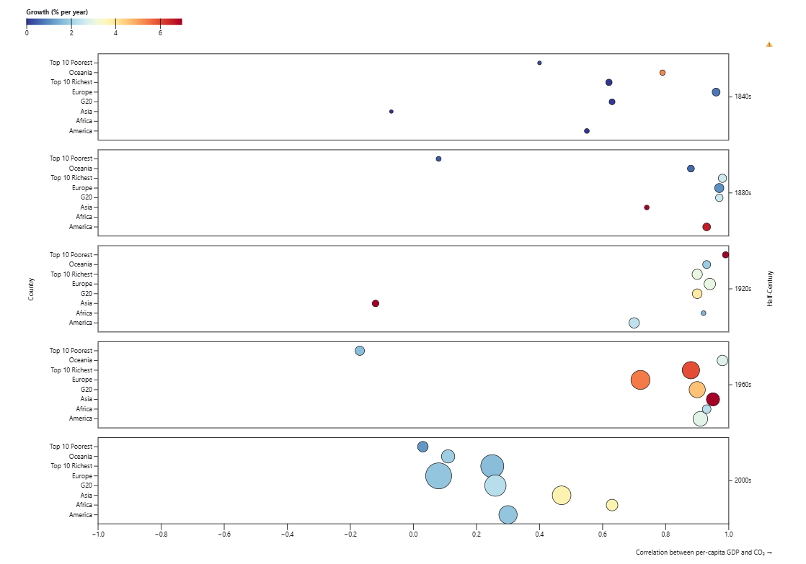

# Growth Gases Geopolitics

Interactive webapp built with [Observable Framework](https://observablehq.com/framework).

Explore the evolution of CO2 emissions from many different perspectives
**CAN WE SAVE THE WORLD?**  

**Live demo:** [https://observablehq.com/@oriol-bustos/growth-gases-geopolitics](https://observablehq.com/@oriol-bustos/growth-gases-geopolitics)

_This version is not deployed via GitHub Pages yet, but is available on the original Observable Notebook._
